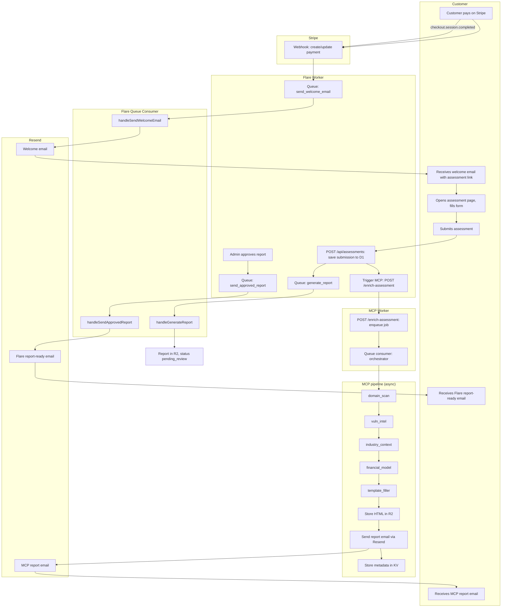
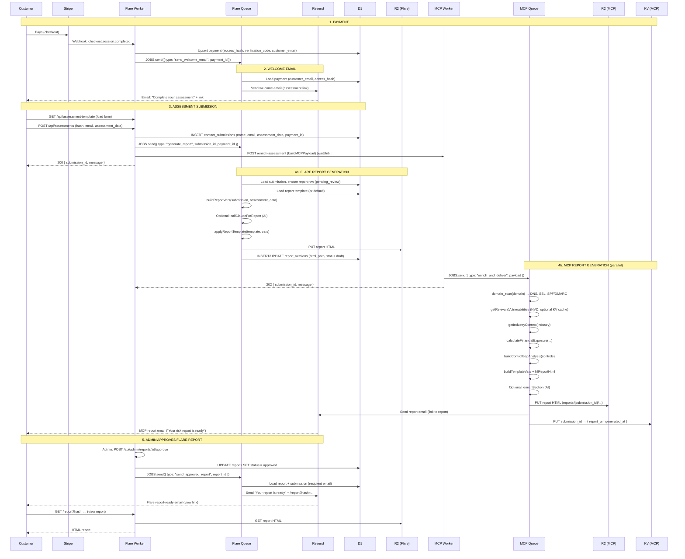

# Full lifecycle: customer payment → report(s) received

This document describes the end-to-end flow from payment to the customer receiving the **Flare report** (after admin approval), which includes **MCP enrichment** (domain, vuln, industry, financial) merged into a single report.

**To run the full flow yourself:** see **[Full lifecycle test](FULL_LIFECYCLE_TEST.md)** for step-by-step instructions (Stripe test mode, assessment, approval, report link).

---

## High-level flow

---

## Detailed sequence (all system tasks)

---

## Task list by system

### Stripe
- Process payment (checkout).
- Send webhook `checkout.session.completed` (and optionally `payment_intent.succeeded`) to Flare.

### Flare Worker (HTTP)
- **Webhook:** Verify signature, upsert payment in D1, enqueue `send_welcome_email`.
- **GET /api/assessment-template:** Return assessment form config or custom HTML from D1.
- **POST /api/assessments:** Validate body, resolve payment from hash, rate-limit check, optional Turnstile; INSERT into `contact_submissions`; enqueue `generate_report` (if payment_id); build MCP payload and `POST` to MCP `/enrich-assessment` (fire-and-forget via `waitUntil`); return 200 with `submission_id`.
- **GET /report?hash=...:** Resolve report by view_hash, optionally verify view_code; serve report HTML from R2.
- **Admin:** Approve report → UPDATE report status, enqueue `send_approved_report`.

### Flare Queue Consumer
- **send_welcome_email:** Load payment from D1; build assessment URL; send welcome email via Resend.
- **generate_report:** Load submission and assessment_data from D1; ensure report row; load report template from D1; build report vars (optionally call Claude); apply template; upload HTML to R2; insert/update report_versions.
- **send_approved_report:** Load report and submission from D1; build report view URL; send “report ready” email via Resend; update report status to `sent`.

### MCP Worker (HTTP)
- **POST /enrich-assessment:** Validate payload (submission_id, domain, user_email, etc.); enqueue `enrich_and_deliver`; return 202 with message and submission_id.
- **GET /** (or other paths): Return 404.

### MCP Queue Consumer
- **enrich_and_deliver:** Run orchestrator: `domain_scan(domain)` → `getRelevantVulnerabilities(env, keywords)` → `getIndustryContext(industry)` → `calculateFinancialExposure(...)` → `buildControlGapAnalysis(controls)` → `buildTemplateVars` + `fillReportHtml` → optional `enrichSection` (AI) → `generateAndStoreReport(env, submission_id, html)` (R2 put) → `sendReportEmail(env, { to, subject, htmlBody, reportUrl })` (Resend) → `REPORT_META.put(submission_id, metadata)`. MCP JSON is never stored.

### Resend
- Send welcome email (assessment link).
- Send MCP report email (report link; from MCP service).
- Send Flare “report ready” email (report view link; from Flare queue).

### D1 (Flare)
- Store payments, contact_submissions (with assessment_data), reports, report_versions, email_logs, stripe_webhook_events, etc.
- Report template and assessment template (admin-editable).

### R2 (Flare)
- Store generated Flare report HTML (by report id / version).

### R2 (MCP)
- Store MCP report HTML (by submission_id and timestamp).

### KV (MCP)
- Store only report metadata per submission_id: `{ report_url, pdf_url (optional), report_text (snippet), generated_at }`. MCP JSON is not persisted.

---

## Order of events (customer perspective)

| # | Event |
|---|--------|
| 1 | Customer pays on Stripe. |
| 2 | Customer receives welcome email with assessment link. |
| 3 | Customer opens link, fills assessment, submits. |
| 4 | Customer receives **MCP report email** (automatically, from MCP pipeline). |
| 5 | Admin approves Flare report in Admin → Reports. |
| 6 | Customer receives **Flare report-ready email** with link to view the full Flare report. |
| 7 | Customer opens report link to view the Flare report (HTML from R2). |

So the customer gets **two** report-related emails: one from MCP (risk report, no approval step) and one from Flare (main report, after admin approval).
